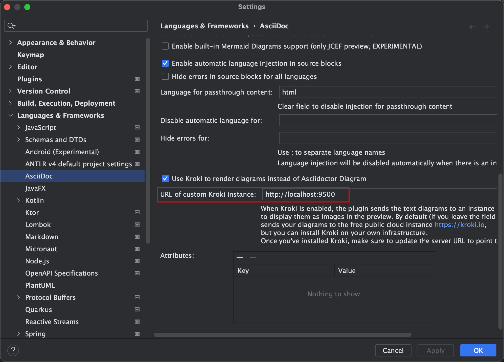
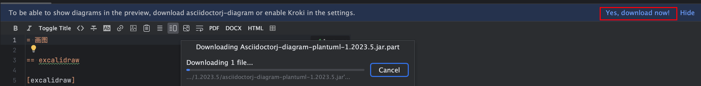

tags:: [[tagIntelliJIDEA]] [[tagAsciiDoc]]

- 环境信息
	- IntelliJ IDEA 2023.1.3
- 使用 Docker 安装 Kroki 服务 [[根据文本描述创建图表服务 Kroki]]
- IntelliJ IDEA 已安装 [AsciiDoc - IntelliJ IDEs Plugin](https://plugins.jetbrains.com/plugin/7391-asciidoc)
- 修改 IntelliJ IDEA 配置 [Preferences | Languages & Frameworks | AsciiDoc](jetbrains://idea/settings?name=Languages+%26+Frameworks--AsciiDoc)
	- 
- 如果没有 kroki 选项
	- 