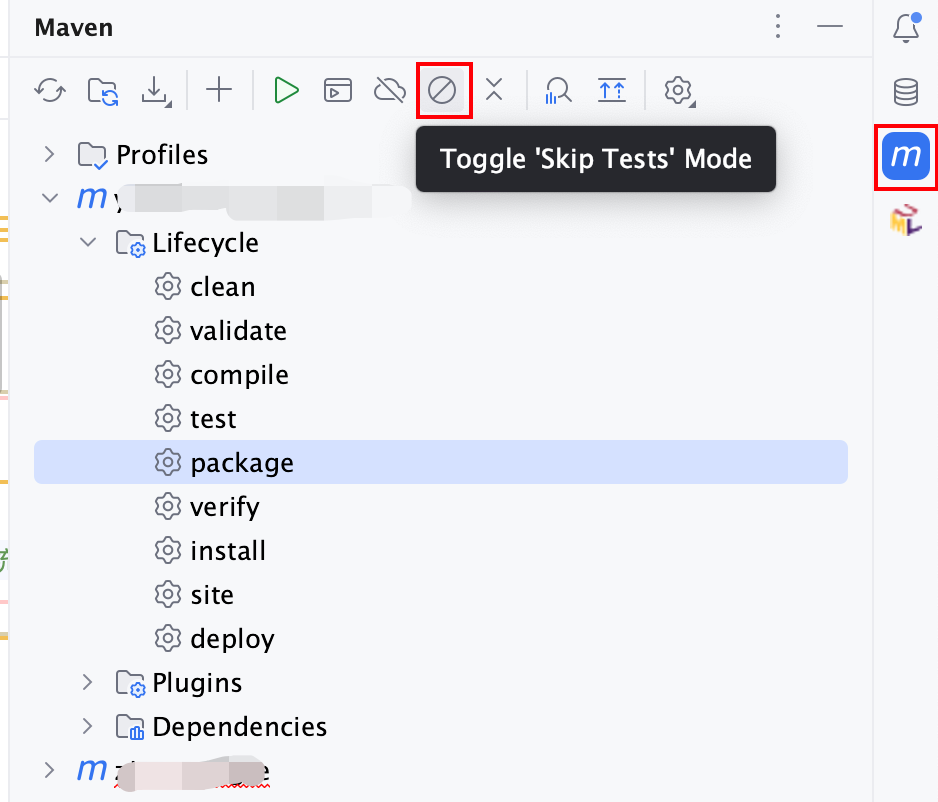

tags:: [[tagMaven]]

- 打包命令中跳过
	- ```shell
	  # 不执行测试用例，但编译测试用例类生成相应的class文件至target/test-classes下
	  mvn clean install -DskipTests
	    
	  # 不执行测试用例，也不编译测试用例类
	  mvn clean package -Dmaven.test.skip=true
	  ```
- pom.xml 文件中跳过
	- ```xml
	  <build>
	    <plugins>
	      <plugin>
	        <groupId>org.apache.maven.plugins</groupId>
	        <artifactId>maven-surefire-plugin</artifactId>
	        <configuration>
	          <skip>true</skip> <!-- maven 打包时跳过测试 -->
	        </configuration>
	      </plugin>
	    </plugins>
	  <build>
	  ```
- IntelliJ IDEA 中跳过
	- {:height 560, :width 663}