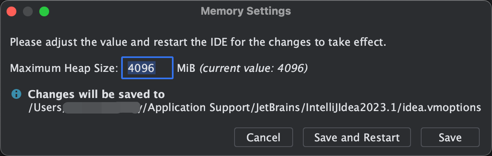
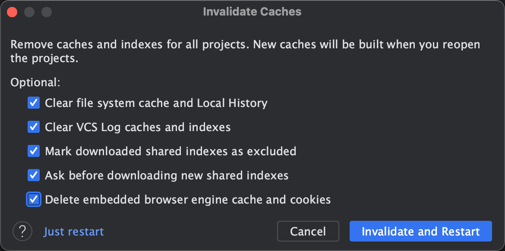
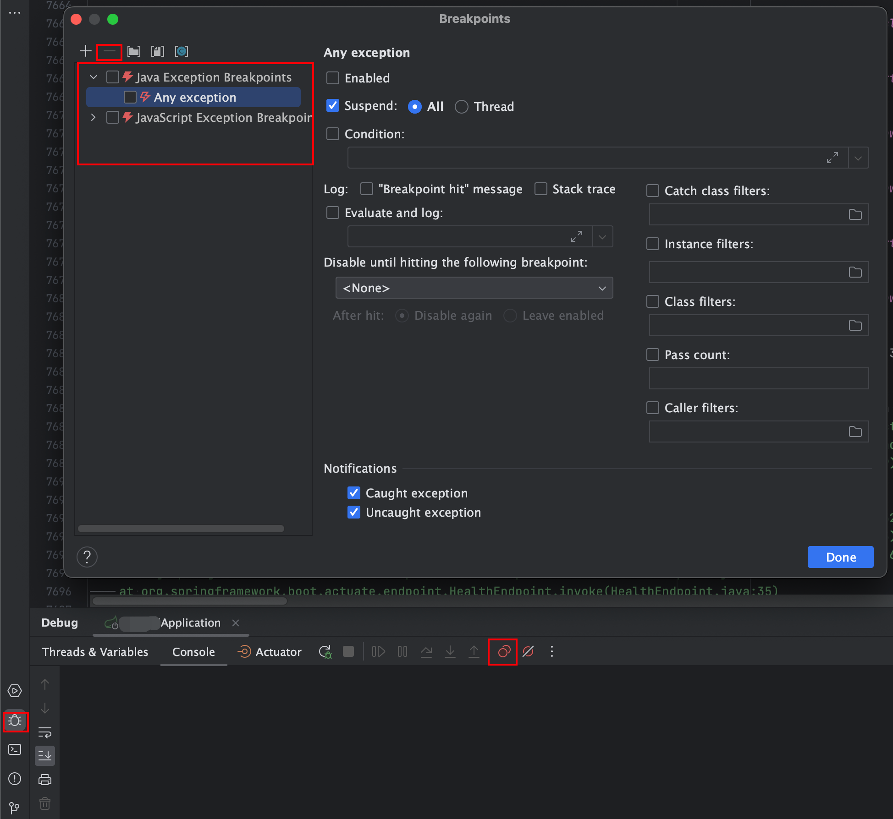

tags:: [[tagIntelliJIDEA]]

- 版本
	- macOS：`13.4.1 (22F82)`
	- IntelliJ IDEA：`2023.1.3 (Ultimate Edition)，Build #IU-231.9161.38, built on June 20, 2023`
- 情况1
	- IntelliJ IDEA JVM Maximum Heap Size 调大
	- Help | Change Memory Settings
	- 
- 情况2
	- 清理 IntelliJ IDEA 缓存
	- File | Invalidate Caches
	- 
- 情况3
	- 取消 IntelliJ IDEA 中的所有断点
	- 
- 情况4
	- 关闭一些科学上网软件
- 情况5
	- ```bash
	  # 查看本机名称
	  $ hostname
	  xxxMacBook-Pro.local
	  # 修改host文件
	  $ sudo vim /etc/hosts
	  #修改条目如下，注意分隔符是TAB，不是空格
	  127.0.0.1	localhost	xxMacBook-Pro.local
	  ::1     localhost	xxxMacBook-Pro.local
	  ```
- 参考资料
	- [Idea突然启动SpringBoot项目变的很慢](https://blog.csdn.net/ai249841929/article/details/131181254)
	- [Mac IDEA启动SpringBoot项目过慢](http://81.70.159.205/2019/05/06/IdeaSpringBoot/)